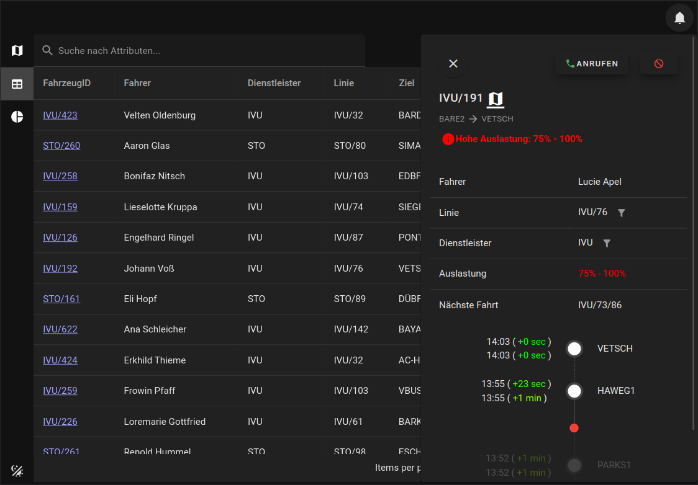

# HeRuMJucKeln [(Live version here)](https://swc.pages.rwth-aachen.de/teaching/summer-term-2023/daten-die-uns-bewegen/herumjuckeln/herumjuckeln/)

## Screenshots


Map in Dark Mode

<details>

<summary>More Screenshots (open)</summary>


Sidebar in Dark Mode


Sidebar in Light Mode


Table on an iPad Air


Dashboard in Light Mode

</details>

<br>

---

<br>

Look at the [Nuxt 3 documentation](https://nuxt.com/docs/getting-started/introduction) to learn more.

## Setup

Make sure to install the dependencies:

```bash
# npm
npm install
```

## Development Server

Start the development server on `http://localhost:3000`

```bash
npm run dev
```

## Linter

This project uses both eslint and prettier in increase code quality.
Before submitting code please make sure all rules are followed, or ignore them explicitly where appropriate.

```bash

# check for rule violations
npm run lint

# some rules can be fixed automatically, run
npm run lint:fix
```

In code you may ignore rules likes this:

```ts
// eslint-disable-next-line no-use-before-define
const thing = new Thing();
```

## Production

Build the application for production:

```bash
npm run build
```

Locally preview production build:

```bash
npm run preview
```

Preview app on localhost:3000

```bash
npm run build && npm run preview
```

### Configuration

This list of environment variables is best-effort, most configuration is done in `nuxt.config.ts`.

- **Production Mode:**
  as customary, `NODE_ENV` can be set to `development` and `production`
- **Router Base Path:**
  use `NUXT_BASE_URL` to set the router base, default (prod): `/teaching/summer-term-2023/daten-die-uns-bewegen/herumjuckeln/herumjuckeln/`, default (dev): `/`
- **Mapbox API Key:**
  `MAPBOX_PK` defaults to Max' PK. There is no guarantee it will remain valid in the future.
- **IVU API Host:**
  `IVU_API_HOST` defaults to `https://rwth.ivu.de/fl`. No trailing slash!

Check out the [deployment documentation](https://nuxt.com/docs/getting-started/deployment) for more information.
